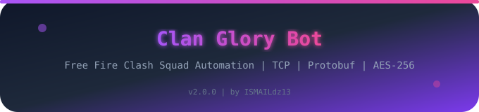
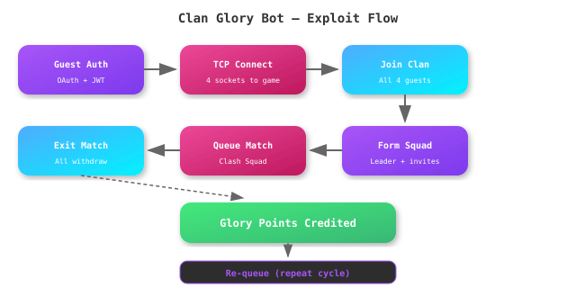

<div align="center">




</div>

---

## 📋 Table of Contents

| # | Section |
|---|---------|
| 1 | [Overview](#-overview) |
| 2 | [Features](#-features) |
| 3 | [Installation](#-installation) |
| 4 | [Usage](#-usage) |
| 5 | [How It Works](#-how-it-works) |
| 6 | [Architecture](#-architecture) |
| 7 | [Configuration](#-configuration) |
| 8 | [Project Structure](#-project-structure) |
| 9 | [FAQ](#-faq) |

---

## 👋 Overview

**Clan Glory Bot** is a fully automated Free Fire bot that exploits the Clash Squad game mode to farm glory points. It uses 4 guest accounts that join a clan, form a squad, queue for a match, immediately exit — and still receive glory points for participation. The cycle repeats automatically.

Built with TCP socket communication, protobuf packets, and AES-256 encryption.

---

## ✨ Features

| Feature | Description |
|---------|-------------|
| 🤖 **Fully Automatic** | No manual intervention — auto-leader, auto-squad, auto-queue |
| 🎯 **Clash Squad Exploit** | Queue → exit immediately → glory points credited |
| 📡 **TCP Communication** | Direct socket connection to game servers |
| 🔐 **AES-256 Encryption** | All packets encrypted with Garena's scheme |
| 📦 **Protobuf Packets** | Join clan, squad, queue, and exit packets |
| 🔄 **Auto-Reconnect** | Recovers from TCP drops automatically |
| ⚡ **Fast Cycles** | ~23 seconds per cycle, ~200 cycles in 76 minutes |
| 🌐 **Multi-Region** | BD, IND, US, ME server support |
| 📱 **Termux Ready** | Works on Android via Termux |
| 💾 **Guest Manager** | JSON-based guest account storage |

---

## 📦 Installation

<details open>
<summary><b>Termux (Android)</b></summary>

<br>

```bash
# Clone the repo
git clone https://github.com/ISMAILdz13/FreeFireClanBot.git
cd FreeFireClanBot

# Install dependencies
pkg install python python-pip
pip install httpx[http2] pycryptodome protobuf pyyaml aiohttp

# Edit guests.json with your accounts
nano data/guests.json

# Run the bot
python3 clan_glory_bot.py
```

</details>

<details>
<summary><b>Linux / macOS</b></summary>

<br>

```bash
git clone https://github.com/ISMAILdz13/FreeFireClanBot.git
cd FreeFireClanBot
pip install -r requirements.txt
```

</details>

---

## 🎮 Usage

```bash
# Default: clan 3100938923, region ME, 200 cycles
python3 clan_glory_bot.py

# Custom clan and region
python3 clan_glory_bot.py --clan-id 3100938923 --region ME

# More cycles
python3 clan_glory_bot.py --cycles 500

# Faster cycles (less wait time)
python3 clan_glory_bot.py --match-wait 10 --exit-wait 3 --cycles 300
```

### Arguments

| Argument | Default | Description |
|----------|---------|-------------|
| `--clan-id` | 3100938923 | Target clan ID to join |
| `--region` | ME | Server region (ME, BD, IND, US) |
| `--cycles` | 200 | Number of exploit cycles |
| `--match-wait` | 15 | Seconds to wait for matchmaking |
| `--exit-wait` | 5 | Seconds to wait after exit for glory credit |

---

## 🔧 How It Works

### Exploit Flow

1. **4 guest accounts** authenticate via OAuth → MajorLogin → JWT
2. Each guest connects to the game server via **TCP socket**
3. All 4 guests **join the target clan**
4. First guest becomes **squad leader** (auto-selected)
5. Leader **opens a squad** and invites all other members
6. Members **auto-join** the squad
7. Leader queues for **Clash Squad match** (FS packet)
8. Wait ~15 seconds for matchmaking
9. **ALL members immediately exit/withdraw** (ExiT packet)
10. System awards **glory points** for participation
11. Wait ~5 seconds for glory to credit
12. **Re-queue** immediately — repeat

### Timing

| Parameter | Duration |
|-----------|----------|
| Per cycle | ~23 seconds |
| 200 cycles | ~76 minutes |
| 500 cycles | ~191 minutes |

---

## 🏗️ Architecture



### Module Overview

| Module | File | Purpose |
|--------|------|---------|
| **Main Bot** | `clan_glory_bot.py` | Orchestrates the entire exploit flow |
| **TCP Module** | `OB54-TCP-BOT/` | Direct TCP communication with game servers |
| **Protobuf** | `OB54-TCP-BOT/Pb2/` | Compiled protobuf definitions |
| **Encryption** | `OB54-TCP-BOT/xC4.py` | AES-256 packet encryption |
| **Guest Data** | `data/guests.json` | Guest account credentials |
| **Config** | `config/settings.yaml` | Bot configuration |
| **Regions** | `config/regions.yaml` | Server endpoints per region |

---

## ⚙️ Configuration

Edit `config/settings.yaml`:

```yaml
bot:
  name: "ClanGloryBot"
  version: "2.0.0"

server:
  target_region: "ME"
  game_version: "OB54"

encryption:
  main_key: "Yg&tc%DEuh6%Zc^8"
  main_iv: "6oyZDr22E3ychjM%"
```

Edit `data/guests.json` with your guest accounts:
```json
[
  {
    "uid": "YOUR_GUEST_UID",
    "password": "YOUR_GUEST_PASSWORD",
    "region": "ME"
  }
]
```

You need at least 4 guest accounts for the bot to work.

---

## 📁 Project Structure

```
FreeFireClanBot/
├── clan_glory_bot.py          # Main bot — orchestrates exploit cycle
├── requirements.txt            # Python dependencies
├── CLAN_GLORY_TEST_LOG.md      # Test results & documentation
├── config/
│   ├── settings.yaml           # Bot configuration
│   └── regions.yaml            # Server endpoints per region
├── data/
│   └── guests.json             # Guest account credentials (4+ needed)
├── OB54-TCP-BOT/               # TCP communication module
│   ├── main.py                 # TCP bot logic
│   ├── xC4.py                  # AES-256 encryption
│   ├── xHeaders.py             # HTTP header construction
│   ├── xKEys.py                # Key management
│   ├── xPARA.py                # Parameter constants
│   ├── byte.py                 # Byte utilities
│   ├── emotes.json             # Emote ID mappings
│   ├── protobuf_decoder/       # Protobuf decoding utilities
│   └── Pb2/                    # Compiled protobuf files
│       ├── MajoRLoGinrEq_pb2.py   # Login request
│       ├── MajoRLoGinrEs_pb2.py   # Login response
│       ├── PorTs_pb2.py           # Port definitions
│       ├── ChangeName_pb2.py      # Name change packet
│       ├── CreateGuild_pb2.py     # Guild creation
│       ├── Team_msg_pb2.py        # Team messaging
│       └── ...                    # 30+ protobuf definitions
├── src/proto/compiled/         # Additional compiled protobufs
├── assets/                     # README SVGs
├── LICENSE
└── .gitignore
```

---

## ❓ FAQ

<details>
<summary><b>How many guest accounts do I need?</b></summary>

Minimum 4. The bot needs a full squad (leader + 3 members) to queue for Clash Squad.

</details>

<details>
<summary><b>Does this work on free Termux?</b></summary>

Yes! All connections use HTTPS port 443 for auth, and TCP connections go through standard ports. No special network access needed.

</details>

<details>
<summary><b>How fast is each cycle?</b></summary>

About 23 seconds per cycle. The default 200 cycles take ~76 minutes. You can adjust `--match-wait` and `--exit-wait` to speed up or slow down.

</details>

<details>
<summary><b>Does it auto-reconnect?</b></summary>

Yes. If a TCP connection drops, the bot reconnects automatically and resumes the cycle.

</details>

<details>
<summary><b>What servers does it use?</b></summary>

Default is ME (MENA) region via `loginbp.ggpolarbear.com`. You can switch to BD, IND, or US via `--region`.

</details>

---

## 👤 Credits

- **Developer**: ISMAILdz13 (@ISMAILdz13)
- **Repository**: [github.com/ISMAILdz13/FreeFireClanBot](https://github.com/ISMAILdz13/FreeFireClanBot)

## 📄 License

MIT License — see [LICENSE](LICENSE) file.

---

<div align="center">
<sub>⭐ Star this repo if it helps you</sub>
</div>
